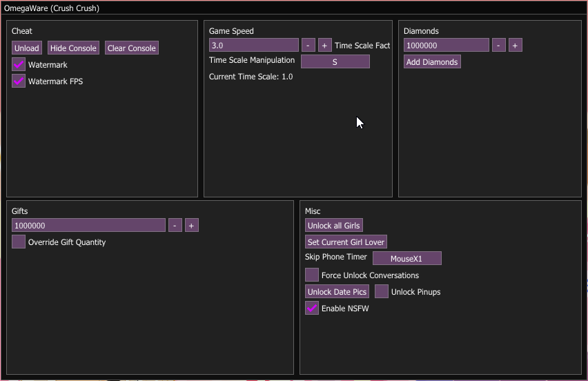
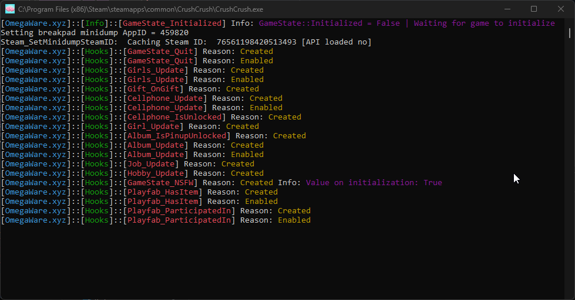

# Crush Crush Cheat
A cheat made for the Steam version of  <a href="https://store.steampowered.com/app/459820/Crush_Crush/">Crush Crush

# Why?
Before I started this project, I was looking into reverse engineering and hacking Unity games, and I know the best way I learn is by doing

So I looked around on steam to find a free game made in Unity and I found Crush Crush, I was not interested in the content of the game just that it was made in Unity.

# Known Issues
I am aware of some issues when trying to use this cheat with a version of the game from countries that don't have the NSFW content avaiable, now because the NSFW content is avaiable in my country I'm not sure how I can go about fixing this

# Dependencies
Microsoft Visual C++ Redistributable x86 - https://aka.ms/vs/17/release/vc_redist.x86.exe 
Microsoft Visual C++ Redistributable x64 - https://aka.ms/vs/17/release/vc_redist.x64.exe 
DirectX End-User Runtimes (June 2010) - http://www.microsoft.com/en-us/download/confirmation.aspx?id=8109

# Images

# Features
<li  class="has-line-data"  data-line-start="8"  data-line-end="9">An in-game menu created by hooking the games Direct-X 11 with Keiro and using Dear-ImGui to render</li>

<li  class="has-line-data"  data-line-start="9"  data-line-end="10">The ability to unload the DLL at anytime to resume normal game function</li>

<li  class="has-line-data"  data-line-start="10"  data-line-end="11">A console attached to the game used for outputting debug information and hook status with a button to enable and disable it</li>

<li  class="has-line-data"  data-line-start="11"  data-line-end="12">A simple watermark in the top right corner that displays the cheat’s title and the current FPS</li>

<li  class="has-line-data"  data-line-start="12"  data-line-end="14">Hooks for many of the games internal functions using MinHook</li>

 <h1  class="code-line"  data-line-start=14  data-line-end=15  >Cheats</h1>

<li  class="has-line-data"  data-line-start="11"  data-line-end="12">Menu 
– Toggle using the <strong>Insert</strong> key

<li  class="has-line-data"  data-line-start="11"  data-line-end="12">Cheat Section 
– <strong>Unload</strong>: A button that will unload the cheat from the game, which can also be achieved by pressing the <strong>End</strong> key

<li  class="has-line-data"  data-line-start="11"  data-line-end="12">Speed Hack Section 
– This cheat modifies the games internal time scale to increase or decrease the simulation speed 
– <strong>Factor</strong>: An unlabeled integer input field that specifies how much to increase the time scale by 
– <strong>Speed Hack</strong>: A checkbox which enables or disables this feature

<li  class="has-line-data"  data-line-start="11"  data-line-end="12">Diamonds Section 
– This cheat adds diamonds (the premium currency) to the current save 
– <strong>Quantity</strong>: An unlabeled integer input field specifying the quantity of diamonds to add (can be negative) 
– <strong>Give Diamonds</strong>: A button that will execute the games GiveDiamond function

<li  class="has-line-data"  data-line-start="11"  data-line-end="12">Gifts Section 
– This cheat enables a hook which upon gifting one of the girls an item modifies the quantity to the set number 
– <strong>Quantity</strong>: An integer input field specifying what the number of gifts should be set to 
– <strong>Override Gift Quantity</strong>: A checkbox which enables or disables this feature

<li  class="has-line-data"  data-line-start="11"  data-line-end="12">Misc Section 
– <strong>Unlock All Girls</strong>: A button, this cheat will unlock all of the characters regardless of you owning the correct bundles or if you meet their requirements (Will not persist after reload of a save if disabled, although the girls stats and progress will persist if the game is saved) 
– <strong>Unlock Date Picks</strong>: A button, this cheat will unlock all of the memory album date photos for all currently unlocked girls (Will persist if the game is saved) 
– <strong>All Girls Lover</strong>: A checkbox, this cheat enables a hook which is triggered on game update, which will set all girls relation ship level to <strong>Lover</strong> (Will persist if the game is saved) 
– <strong>Phone Skip Wait</strong>: A button, this cheat will skip the timer between messages of the current open phone conversation (will do nothing if the phone is closed) 
– <strong>Unlock Phone Convos</strong>: A checkbox, this cheat enables a hook that will unlock all phone conversations regardless of you owning the correct bundles or if you meet their requirements (Will not persist after save if disabled, although the progress of any conversations will persist if the game is saved) 
– <strong>Set Skip Key</strong>: A button, after pressing this button the cheat will freeze the game and wait for the user to press any key and will then set it to be the skip key and display it 
– <strong>Unlock Pinups</strong>: A checkbox, this cheat will reveal all memory album pinup photos while enabled, a quick note is that two of the pinups will remain hidden because they don’t actually exist to my knowledge (Will not persist) 
– <strong>Unlock All Jobs</strong>: A checkbox, this cheat enables a hook that will unlock all jobs regardless of you meeting the requirements (Unlocked jobs will not persist after save, but level, progress, and gilding will) 
– <strong>Unlock All Hobbies</strong>: A checkbox, this cheat enables a hook that will unlock all hobbies regardless of you meeting the requirements (Unlocked hobbies will not persist after save, but level, progress, and gilding will)
– <strong>Toggle NSFW</strong>: A checkbox, this cheat will set a GameState bool to true or false to allow the game to show NSFW features, images, and scenes. (I have not tested if this works if you do not own the NSFW DLC or if you live in a country where the NSFW DLC is not available)