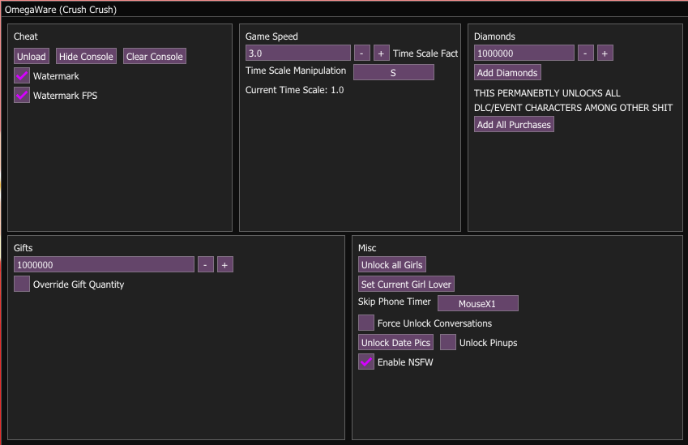
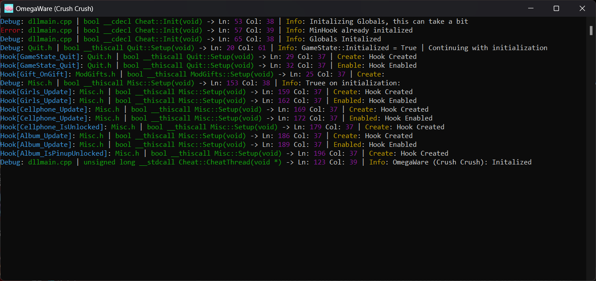

# Crush Crush Cheat
A cheat made for the Steam version of <a href="https://store.steampowered.com/app/459820/Crush_Crush/">Crush Crush

Check out my cheat for [Blush Blush](https://github.com/Omega172/Blush-Blush-Cheat/) it's the same as this game but it's about guys instead

The key to show/hide the GUI is "Insert"

# Why?
Before I started this project, I was looking into reverse engineering and hacking Unity games, and I know the best way I learn is by doing

So I looked around on steam to find a free game made in Unity and I found Crush Crush, I was not interested in the content of the game just that it was made in Unity.

# IF THE MENU IS NOT SHOWING RUN THE GAME IN WINDOWED MODE AND EXPAND THE WINDOW BEFORE INJECTING THE CHEAT!!!

# Dependencies
Mono - https://www.mono-project.com/download/stable/ (Only if you want to compile this yourself) 
Microsoft Visual C++ Redistributable x86 - https://aka.ms/vs/17/release/vc_redist.x86.exe 
Microsoft Visual C++ Redistributable x64 - https://aka.ms/vs/17/release/vc_redist.x64.exe 
DirectX End-User Runtimes (June 2010) - http://www.microsoft.com/en-us/download/confirmation.aspx?id=8109

# Images

# Features
<li  class="has-line-data"  data-line-start="8"  data-line-end="9">An in-game menu created by hooking the games Direct-X 11 with Keiro and using Dear-ImGui to render</li>

<li  class="has-line-data"  data-line-start="9"  data-line-end="10">The ability to unload the DLL at anytime to resume normal game function</li>

<li  class="has-line-data"  data-line-start="10"  data-line-end="11">A console attached to the game used for outputting debug information and hook status with a button to enable and disable it</li>

<li  class="has-line-data"  data-line-start="11"  data-line-end="12">A simple watermark in the top left corner that displays the cheat’s title and the current FPS</li>

<li  class="has-line-data"  data-line-start="12"  data-line-end="14">Hooks for many of the games internal functions using MinHook</li>
