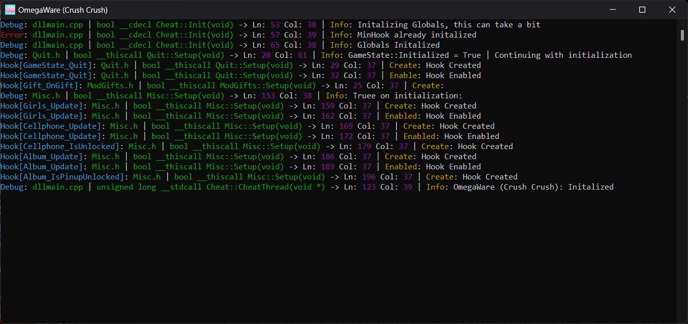

# I am porting to BepInEx
I am porting the cheat from a C++ Injected DLL to BepInEx, Check it out the code [here](https://github.com/Omega172/Crush-Crush-Cheat/tree/BepInEx). When the port is done, I will update this README to reflect the changes and move the old C++ code to a separate branch for anyone who wants to check it out or still use it.

# Crush Crush Cheat

A cheat made for the Steam version of [Crush Crush](https://store.steampowered.com/app/459820/Crush_Crush/)

The key to show/hide the GUI is "Insert"

## Why?
Before I started this project, I was looking into reverse engineering and hacking Unity games, and I know the best way I learn is by doing

So I looked around on steam to find a free game made in Unity and I found Crush Crush.

# How to Inject
https://youtu.be/4X9lxytX4ek?si=xJ7Ouy6d0HJwZwMR

## Dependencies
Microsoft Visual C++ Redistributable x86 - https://aka.ms/vs/17/release/vc_redist.x86.exe 
Microsoft Visual C++ Redistributable x64 - https://aka.ms/vs/17/release/vc_redist.x64.exe 
DirectX End-User Runtimes (June 2010) - https://www.microsoft.com/en-us/download/details.aspx?id=35

Mono - https://www.mono-project.com/download/stable/ (Only if you want to compile this yourself) 

## Images

## Features
 - An in-game menu created by hooking the games Direct-X 11 with Keiro and using Dear-ImGui to render
 - The ability to unload the DLL at anytime to resume normal game function
 - A console attached to the game used for outputting debug information and hook status with a button to enable and disable it
 - A simple watermark in the top left corner that displays the cheat’s title and the current FPS
 - Hooks for many of the games internal functions using MinHook
