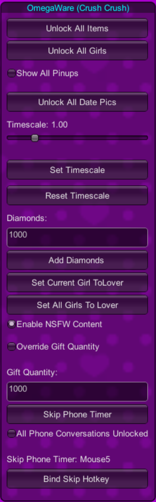

# Note
> Check out my cheat for Blush Blush the "brother" game to Crush Crush, [OmegaWare (BlushBlush)](https://github.com/Omega172/Blush-Blush-Cheat) it is a copy & paste of this cheat but with fixes to work for its changes.
>
> Join our [discord](https://discord.gg/zc8E7dYYRe)

# Built for BepInEx 6.0.0-be
netstandard.dll: Present  
Unity: 2019.4.41f2  
BepInEx Ver: 6.0.0-be.755  

# Install Instructions
1. Install [BepInEx 6.0.0-be.755](https://builds.bepinex.dev/projects/bepinex_be/755/BepInEx-Unity.Mono-win-x86-6.0.0-be.755%2B3fab71a.zip) into your Crush Crush game directory 
2. Run the game once to generate the config files and then close it 
3. Download the latest release from the releases tab and place the `OmegaWare_CrushCrush.dll` file in `BepInEx/plugins` 
4. Start the game and enjoy the cheats! 
Menu show/hide key is Insert by default, but can be changed in the config file found in `BepInEx/config/CrushCrush.cfg` 

## Building
Install [.NET 10.0.202 SDK](https://dotnet.microsoft.com/en-us/download/dotnet/10.0) 
Install [BepInEx 6.0.0-be.755](https://builds.bepinex.dev/projects/bepinex_be/755/BepInEx-Unity.Mono-win-x86-6.0.0-be.755%2B3fab71a.zip) if you haven't already 

OmegaWare-CrushCrush.csproj:
- Change line 16 to point to `..\YOUR\GAME\DIR\CrushCrush\CrushCrush_Data\Managed`
- If making a PR, make sure to update the version on line 7

Then run `dotnet restore` and make any changes you want 
To build run `dotnet build`

## Features
- Unlock All Items & Girls (Now combined into one feature)
- Show all album pinups
- Unlock all album date pics
- Game Speed Slider & Toggle Buttons
- Add Diamonds
- Set Current Girl To Lover
- Set All Girls Lover
- All Phone Conversations Unlocked
- Enable NSFW
- Gift quantity override
- Skip Phone Timer & Hotkeys

- (Thanks to [sliperhr](https://github.com/sliperhr) for the suggestions & [this](https://fearlessrevolution.com/viewtopic.php?f=4&t=8211) post for the methods)
	- DLC Unlocker
	- Meet Current Heart Requirement
	- Meet All Current Girl Requirements (Hearts + Skip To Next Love Level)

- Disable Analytics (On by default, can only be disabled by editing the config file found in `BepInEx/config/OmegaWare_CrushCrush.cfg`)

- Unlock All Outfits

### TODO
- Outfits Cost 1 Diamond
- Gifts Cost No Diamonds
- Free Diamond Purchasables
- Max Hobby Level
- No Job Cooldown
- Max Highlighted Job Experience

## Images
Menu  

